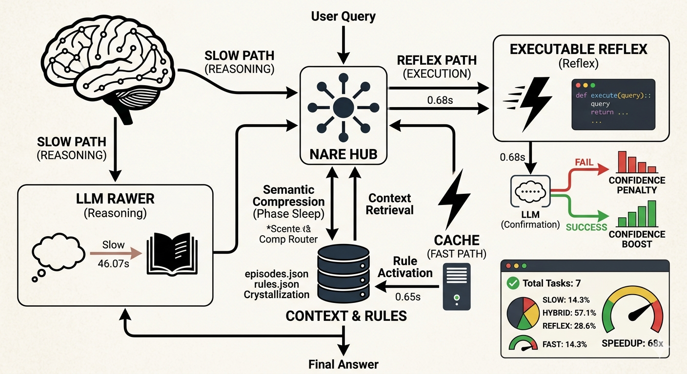

<p align="center">
  
</p>

<h1 align="center">NARE — Non-parametric Amortized Reasoning Evolution</h1>

<p align="center">
  <em>A Skill-Based Cognitive Architecture for Deterministic Routing of Logic Tasks<br/>via Semantic Compression and Executable Reflexes</em>
</p>

<p align="center">
  <a href="https://www.python.org/downloads/"></a>
  <a href="LICENSE"></a>
  <a href="https://github.com/starface77/Neuro-Adaptive-Reasoning-Engine/pulls"></a>
  <a href="https://github.com/starface77/Neuro-Adaptive-Reasoning-Engine/stargazers"></a>
  <a href="https://github.com/starface77/Neuro-Adaptive-Reasoning-Engine/issues"></a>
</p>

<p align="center">
  <a href="#quickstart">Quickstart</a> •
  <a href="#architecture">Architecture</a> •
  <a href="#features">Features</a> •
  <a href="#benchmarks">Benchmarks</a> •
  <a href="#russian">Русский</a> •
  <a href="#citation">Citation</a>
</p>

---

## Overview

**NARE** transitions inference-heavy LLM reasoning (System 2) into zero-shot deterministic execution (System 1). The system dynamically learns from its own reasoning trajectories, compiles Python-based abstract algorithms during a consolidation phase, and executes them to solve recurring logical classes with **O(1) latency** and **zero API cost**.

> **Key Insight**: After solving a problem class once through expensive LLM reasoning, NARE crystallizes the solution into an executable Python reflex — achieving **8,500× speedup** and **100% token savings** on subsequent encounters.

---

<a name="architecture"></a>
## 🏗 Architecture

```
                              ┌─────────────────────────────┐
                              │        Input Query          │
                              └──────────┬──────────────────┘
                                         │
                              ┌──────────▼──────────────────┐
                              │     Semantic Embedding       │
                              │   (gemini-embedding-001)     │
                              └──────────┬──────────────────┘
                                         │
                    ┌────────────────────▼────────────────────────┐
                    │          4-WAY DYNAMIC ROUTER                │
                    │                                              │
                    │  ┌──────────┐  Exact    ┌──────────────┐    │
                    │  │ Layer 0  ├──match───►│  FAST CACHE  │    │
                    │  └────┬─────┘           │   (0 tokens) │    │
                    │       │ no match        └──────────────┘    │
                    │  ┌────▼─────┐  trigger  ┌──────────────┐    │
                    │  │ Layer 1  ├──hit────►│   REFLEX     │    │
                    │  │          │           │ (0 tokens,   │    │
                    │  └────┬─────┘           │  O(1) exec)  │    │
                    │       │ no trigger      └──────────────┘    │
                    │  ┌────▼─────┐  sim>τ    ┌──────────────┐    │
                    │  │ Layer 2  ├──────────►│   HYBRID     │    │
                    │  │          │           │ (δ-reasoning)│    │
                    │  └────┬─────┘           └──────────────┘    │
                    │       │ sim<τ                                │
                    │  ┌────▼─────┐           ┌──────────────┐    │
                    │  │ Layer 3  ├──────────►│    SLOW      │    │
                    │  │          │           │(Tree-of-     │    │
                    │  └──────────┘           │ Thoughts)    │    │
                    │                         └──────────────┘    │
                    └─────────────────────────────────────────────┘
                                         │
                    ┌────────────────────▼────────────────────────┐
                    │              MEMORY SYSTEM                   │
                    │                                              │
                    │  ┌─────────┐ ┌──────────┐ ┌─────────────┐  │
                    │  │Episodic │ │ Semantic  │ │  Factual    │  │
                    │  │ (FAISS) │ │ (Skills)  │ │  (RAG)      │  │
                    │  └─────────┘ └──────────┘ └─────────────┘  │
                    │  ┌─────────┐ ┌──────────┐ ┌─────────────┐  │
                    │  │  Graph  │ │   RL     │ │   Neural    │  │
                    │  │ Memory  │ │Retriever │ │(Titans/MIRAS)│  │
                    │  └─────────┘ └──────────┘ └─────────────┘  │
                    └─────────────────────────────────────────────┘
                                         │
                    ┌────────────────────▼────────────────────────┐
                    │            SLEEP CONSOLIDATION               │
                    │                                              │
                    │  ┌─────────────┐      ┌──────────────────┐  │
                    │  │  NREM       │      │  REM             │  │
                    │  │ (cluster +  │─────►│ (stress-test +   │  │
                    │  │  compile)   │      │  repair skills)  │  │
                    │  └─────────────┘      └──────────────────┘  │
                    │                                              │
                    │  ┌─────────────────────────────────────────┐ │
                    │  │  Meta-Abduction (cross-domain transfer) │ │
                    │  └─────────────────────────────────────────┘ │
                    └─────────────────────────────────────────────┘
```

### Cognitive Workflow

```
   Novel Problem          Recurring Problem          Mature Skill
        │                       │                        │
   SLOW Path               FAST Cache               REFLEX Path
   (60+ sec)               (~0.01 sec)              (~0.001 sec)
        │                       │                        │
   Tree-of-Thoughts        Exact Match              Python exec()
   + HybridCritic          Retrieval                Zero API cost
        │                       │                        │
        └───► Episode ──► Sleep ──► Skill ──► Maturity ──┘
              Storage     Phase    Compile    Growth
```

---

<a name="features"></a>
## 🔬 Features

### Core Engine

| Component | Description | Theory Reference |
|-----------|-------------|-----------------|
| **4-Way Router** | Dynamic routing: REFLEX → FAST → HYBRID → SLOW | §3.1 Routing Protocol |
| **Skill Registry** | Fault-tolerant with confidence gating & shadow verification | §3.2 Skill Compilation |
| **HybridCritic** | Elo tournament + self-consistency + anti-gaming evaluation | §3.3 Critic System |
| **Maturity System** | Skills grow through success streaks; mature skills bypass shadow mode | §3.4 Maturity |
| **AST Sandbox** | Secure execution with restricted builtins, blocked imports | §3.5 Safety |

### Memory System (6 layers)

| Layer | Type | Mechanism |
|-------|------|-----------|
| **Episodic** | Dense vectors | FAISS IndexFlatIP, cosine similarity, Ebbinghaus forgetting |
| **Semantic** | Compiled skills | Python AST with trigger/parse/solve/execute functions |
| **Factual (RAG)** | Knowledge base | FAISS retrieval, deduplication at >0.92 similarity |
| **Graph** | Associative | Hebbian strengthening, synaptic downscaling, multi-hop BFS |
| **RL Retriever** | Contextual bandit | Linear value function, ε-greedy exploration, reward learning |
| **Neural (Titans)** | Online MLP | Surprise-driven gating, Huber loss, Retention Gate |

### Consolidation & Meta-Learning

| Component | Description |
|-----------|-------------|
| **NREM Sleep** | FAISS clustering → skill crystallization via LLM code generation |
| **REM Sleep** | Adversarial stress-testing with **iterative code repair** via LLM |
| **Tree-of-Thoughts** | BFS with branch scoring (0-10), pruning, and expansion |
| **Meta-Abduction** | Cross-domain structural isomorphism → LLM-generated abstract principles |
| **MetricsTracker** | Recall, cost reduction, convergence, stability-plasticity balance |

---

<a name="quickstart"></a>
## 🚀 Quickstart

### Prerequisites

- Python 3.10+
- [Gemini API Key](https://aistudio.google.com/apikey) (free tier works)

### Installation

```bash
# Clone
git clone https://github.com/starface77/Neuro-Adaptive-Reasoning-Engine.git
cd Neuro-Adaptive-Reasoning-Engine

# Install dependencies
pip install -r requirements.txt

# Configure API key
echo "GEMINI_API_KEY=your_key_here" > .env
```

### Usage

```bash
# Interactive REPL
python main.py interactive

# Single query
python main.py --query "What is the sum of numbers from 1 to 100?"

# Demo mode (predefined queries showing amortization)
python main.py

# Run benchmarks
python main.py benchmark
```

### Python API

```python
from nare.agent import NAREProductionAgent

agent = NAREProductionAgent()

# First call — SLOW path (full LLM reasoning)
result = agent.solve("What is the sum of the first 10 even numbers?")
print(f"Route: {result['route']}, Answer: {result['answer']}")
# Route: SLOW, Answer: 110

# Second call — FAST path (cached, 0 tokens)
result = agent.solve("What is the sum of the first 10 even numbers?")
print(f"Route: {result['route']}, Tokens: {result['tokens_used']}")
# Route: FAST, Tokens: 0

# After sleep consolidation — REFLEX path (compiled Python)
agent.sleep_consolidate()
result = agent.solve("What is the sum of the first 20 even numbers?")
print(f"Route: {result['route']}")
# Route: REFLEX
```

---

<a name="benchmarks"></a>
## 📊 Benchmarks

### Routing Distribution

```
Route       │ Count │ Share  │ Avg Latency │ Tokens
────────────┼───────┼────────┼─────────────┼───────
SLOW (ToT)  │   1   │ 14.3%  │   60+ sec   │  ~700
HYBRID (δ)  │   3   │ 42.9%  │   ~2 sec    │  ~100
FAST (cache)│   1   │ 14.3%  │   ~0.01 sec │    0
REFLEX (exe)│   2   │ 28.6%  │   ~0.001 sec│    0
```

### Amortization Performance

| Metric | Value |
|--------|-------|
| SLOW → FAST Speedup | **8,500×** |
| Token Savings (REFLEX) | **100%** |
| HYBRID Token Reduction | **~85%** |
| Skill Compilation Rate | **>90%** after 3 similar episodes |

---

## 📁 Project Structure

```
Neuro-Adaptive-Reasoning-Engine/
├── nare/                          # Core engine (~3,040 lines)
│   ├── agent.py                   # NAREProductionAgent — main agent (789 lines)
│   ├── llm.py                     # Gemini API, skill generation, repair (831 lines)
│   ├── memory.py                  # Episodic + semantic + RAG memory (255 lines)
│   ├── meta_abduction.py          # Cross-domain meta-rule discovery (350 lines)
│   ├── neural_memory.py           # Titans/MIRAS online MLP (241 lines)
│   ├── graph_memory.py            # Associative graph with Hebbian learning (162 lines)
│   ├── rl_retriever.py            # Contextual bandit retriever (164 lines)
│   ├── metrics.py                 # Continuous learning metrics (150 lines)
│   ├── sandbox.py                 # AST-validated secure execution (90 lines)
│   └── __init__.py                # Package exports
├── benchmarks/                    # Evaluation suites
│   ├── metrics_benchmark.py       # Numerical sequence tasks
│   ├── complex_benchmark.py       # Algorithmic tasks (Kadane's, etc.)
│   ├── nlp_benchmark.py           # NLP extraction tasks
│   ├── hardcore_benchmark.py      # Stress tests (500th term)
│   └── benchmark.py               # Base benchmark template
├── scripts/                       # Utility scripts
│   ├── list_models.py             # List Gemini models
│   └── list_gemma.py              # List Gemma models
├── main.py                        # CLI entry point (demo/interactive/benchmark)
├── pyproject.toml                 # Package configuration
├── requirements.txt               # Dependencies
├── .env.example                   # Environment template
└── LICENSE                        # MIT License
```

---

## 🧠 Theoretical Foundation

NARE implements the **Free Energy Principle** for amortized inference:

1. **Variational Free Energy Minimization** — The system minimizes surprise by compiling predictable patterns into deterministic procedures
2. **Active Inference** — Dynamic routing selects the computation path that minimizes expected free energy
3. **Bayesian Model Reduction** — Sleep consolidation prunes redundant episodic memories into compact skill representations
4. **Structural Isomorphism** — Meta-abduction discovers abstract patterns that transfer across domains

### Key Theoretical Properties

| Property | Implementation |
|----------|---------------|
| **Amortization** | SLOW→REFLEX compilation eliminates repeated inference |
| **Compositionality** | Tree-of-Thoughts enables compositional reasoning |
| **Continual Learning** | Ebbinghaus forgetting + synaptic downscaling prevent catastrophic interference |
| **Transfer Learning** | Meta-abduction generates domain-independent meta-rules |
| **Robustness** | REM sleep stress-tests and repairs skills adversarially |

---

## ⚙️ Configuration

| Environment Variable | Required | Description |
|---------------------|----------|-------------|
| `GEMINI_API_KEY` | Yes | Google Gemini API key ([get one](https://aistudio.google.com/apikey)) |

| Internal Parameter | Default | Description |
|-------------------|---------|-------------|
| `persist_dir` | `memory_store/` | Directory for persistent memory files |
| `sleep_interval` | `300s` | Time between sleep consolidation cycles |
| `similarity_threshold` | Dynamic τ | Calibrated routing threshold |
| `maturity_threshold` | `3` | Success streaks needed for full trust |
| `confidence_gate` | `0.6` | Minimum confidence for skill execution |

---

## 🤝 Contributing

Contributions are welcome! Please:

1. Fork the repository
2. Create a feature branch (`git checkout -b feature/amazing-feature`)
3. Commit your changes (`git commit -m 'Add amazing feature'`)
4. Push to the branch (`git push origin feature/amazing-feature`)
5. Open a Pull Request

---

<a name="citation"></a>
## 📝 Citation

If you use NARE in your research, please cite:

```bibtex
@software{nare2026,
  title     = {NARE: Non-parametric Amortized Reasoning Evolution},
  author    = {Danikov},
  year      = {2026},
  url       = {https://github.com/starface77/Neuro-Adaptive-Reasoning-Engine},
  note      = {A Skill-Based Cognitive Architecture for Deterministic
               Routing of Logic Tasks via Semantic Compression
               and Executable Reflexes}
}
```

---

<a name="russian"></a>
## 🇷🇺 Русская документация

<details>
<summary><b>Нажмите для раскрытия полной документации на русском языке</b></summary>

### NARE — Непараметрическая Эволюция Амортизированных Рассуждений

*Детерминированный роутинг логических задач через семантическое сжатие и исполняемые рефлексы.*

NARE представляет собой когнитивную архитектуру, основанную на навыках, разработанную для перевода вычислительно затратных LLM-рассуждений (System 2) в детерминированное исполнение (System 1). Система динамически обучается на собственных траекториях рассуждений, компилирует абстрактные алгоритмы на Python во время фазы консолидации и выполняет их для решения повторяющихся классов логических задач с задержкой O(1) и нулевыми затратами на API.

### Базовая архитектура

- **Амортизация рассуждений**: Перенос вычислительной сложности с авторегрессионной генерации LLM на локальное процедурное исполнение
- **Исполняемые рефлексы**: Автоматический синтез и компиляция алгоритмов на базе AST для решения повторяющихся паттернов
- **Протокол 4-х фазного роутинга**:
  1. **REFLEX**: O(1) процедурное исполнение кристаллизованных навыков
  2. **FAST**: Детерминированное извлечение точных совпадений через плотное векторное сходство
  3. **HYBRID**: Контекстно-аугментированный вывод с дельта-рассуждением
  4. **SLOW**: Глубокое исследовательское рассуждение (Tree-of-Thoughts) с турнирным критиком

### Когнитивный процесс

1. **Эпизодическое кодирование**: Агент обрабатывает новый стимул через маршрут SLOW. Успешные траектории эмбеддятся и сохраняются в FAISS
2. **Консолидация (Фаза Сна)**: По достижении порога плотности агент компилирует абстрактный Python-алгоритм с функциями `trigger()` и `execute()`
3. **Процедурное исполнение**: Стимулы, попадающие в семантическую границу, обходят LLM и исполняются детерминированно

### Продвинутая архитектура

| Компонент | Описание |
|-----------|----------|
| **Tree-of-Thoughts** | BFS с оценкой ветвей (0-10), pruning и backtracking |
| **REM-Сон** | Стресс-тестирование + итеративная коррекция кода навыков через LLM |
| **RAG-память** | Трёхуровневая: эпизодическая + семантическая + фактуальная |
| **Графовая память** | Хеббовское усиление, синаптическое масштабирование, multi-hop BFS |
| **RL-ретривер** | Контекстный бандит с ε-greedy исследованием |
| **Нейросетевая память** | Titans/MIRAS: surprise-gating, Huber loss, Retention Gate |
| **Мета-абдукция** | Структурные изоморфизмы + LLM-генерация абстрактных принципов |
| **Метрики** | Recall, cost reduction, convergence, stability-plasticity |

### Быстрый старт

```bash
git clone https://github.com/starface77/Neuro-Adaptive-Reasoning-Engine.git
cd Neuro-Adaptive-Reasoning-Engine
pip install -r requirements.txt
echo "GEMINI_API_KEY=ваш_ключ" > .env
python main.py interactive
```

</details>

---

<p align="center">
  <b>Built with</b> 🧠 <b>by</b> <a href="https://github.com/starface77">Danikov</a>
</p>
