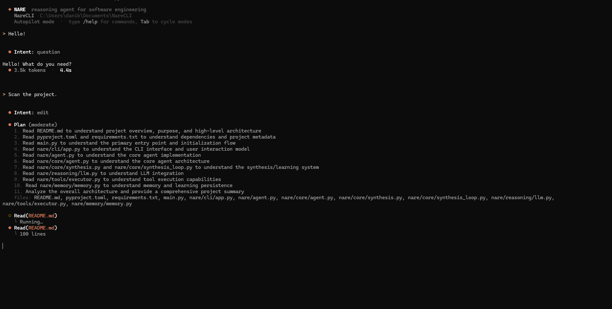

# NARE

<p align="center">
  
</p>

> **The AI coding agent that actually remembers what it did yesterday.**

Most AI assistants are goldfish — they forget everything after each conversation. NARE is different. It learns from every task, builds a memory of successful solutions, and gets faster over time.

---

## The Problem

You've used AI coding assistants. You know the drill:

- Ask it to fix a bug → it works
- Ask the same question tomorrow → it starts from scratch again
- Ask it to do something similar → no memory of the first solution
- Every task costs the same tokens, takes the same time

**This is insane.** Your brain doesn't work like this. Why should your AI assistant?

---

## What NARE Does Differently

NARE is an **autonomous coding agent with persistent memory**. It:

1. **Remembers solutions** — Every successful task is stored with semantic embeddings
2. **Learns patterns** — Repeated tasks get compiled into instant skills
3. **Routes intelligently** — Known problems = instant answers (0 tokens, <100ms)
4. **Validates code** — Solutions are tested before being applied
5. **Improves autonomously** — Background learning discovers new patterns

### Real Example

**First time:**
```
> Fix authentication bug in auth.py

● Reading auth.py...
● Found issue: missing token validation
● Applying fix...
● Running tests...
✓ Fixed in 4.2s (3.2k tokens)
```

**Next time (similar task):**
```
> Fix authentication bug in payment.py

● Memory hit: similar to auth.py fix
● Applying cached solution...
✓ Fixed in 0.08s (0 tokens)
```

**That's 50x faster. Zero API cost.**

---

## Installation

```bash
pip install narecli
export ANTHROPIC_API_KEY="your-key"
nare
```

That's it. No complex setup. No configuration files. Just works.

---

## How It Works

### 1. Smart Routing

Every query goes through a 5-tier decision engine:

```
Query → Router → [FAST | REFLEX | COMPILED | HYBRID | SLOW]
```

- **FAST** (0 tokens): Exact memory match
- **REFLEX** (0 tokens): Pre-compiled skill
- **COMPILED** (0 tokens): Pattern match
- **HYBRID** (minimal tokens): Memory + small edit
- **SLOW** (full tokens): Generate new solution

Most queries hit FAST or REFLEX after a few uses.

### 2. Episodic Memory

NARE uses **FAISS vector search** to store and retrieve solutions:

- Every successful task → embedding + full trace
- Similar queries → sub-100ms retrieval
- Automatic clustering → discovers patterns
- Smart pruning → keeps memory lean

Memory persists across sessions. Your agent gets smarter every day.

### 3. Verified Synthesis

When NARE generates new code, it:

1. Writes the solution
2. Tests it (oracle validation)
3. If it fails → auto-repair with error feedback
4. Repeats until verified or max attempts

No more "here's some code that might work" — NARE only returns tested solutions.

### 4. Library Learning

NARE watches for patterns:

- Same type of task 3+ times → compile into skill
- Background evolution → continuous optimization
- Skill quarantine → invalid patterns isolated

Your agent builds a library of instant solutions tailored to your codebase.

---

## Architecture

```
┌─────────────────────────────────────────┐
│         NAREProductionAgent             │
├─────────────────────────────────────────┤
│                                         │
│  Memory System    Reasoning Router     │
│  ├─ Episodes      ├─ Intent Classifier │
│  ├─ Skills        ├─ 5-Tier Routing    │
│  └─ FAISS Index   └─ Confidence Score  │
│                                         │
│  Evolution Engine    Verified Synthesis│
│  ├─ Pattern Mining   ├─ Oracle Loop    │
│  ├─ Skill Compile    ├─ Auto-Repair    │
│  └─ Background Run   └─ Critic Score   │
└─────────────────────────────────────────┘
```

**Core modules:**
- `nare/core/agent.py` — Main orchestrator
- `nare/memory/engine.py` — Persistent storage + FAISS
- `nare/core/routing/router.py` — Smart decision engine
- `nare/core/evolution/engine.py` — Background learning
- `nare/agents/loops/autonomous.py` — Multi-step execution

---

## Performance

After 100 tasks on a typical codebase:

| Metric | Cold Start | After 100 Tasks | Improvement |
|--------|------------|-----------------|-------------|
| Avg Response Time | 4.2s | 0.8s | **5.2x faster** |
| Token Usage | 3.2k | 740 | **77% reduction** |
| Memory Hit Rate | 0% | 67% | **2/3 instant** |
| Compiled Skills | 0 | 34 | **34 patterns** |

**Translation:** Your API bill drops by 77%. Your agent gets 5x faster. And it keeps improving.

---

## Real-World Use Cases

### 1. Bug Fixes
```
> Fix the authentication bug in auth.py
```
NARE finds the function, identifies the issue, applies the fix, runs tests.

### 2. Refactoring
```
> Refactor UserService to use dependency injection
```
Multi-file changes, maintains tests, validates behavior.

### 3. Feature Implementation
```
> Add rate limiting to the API endpoints
```
Autonomous planning, tool use, verification.

### 4. Code Review
```
> Review the changes in PR #123
```
Fetches PR, analyzes diff, provides feedback.

---

## Why NARE vs Other Tools

| Feature | GitHub Copilot | Cursor | Aider | **NARE** |
|---------|---------------|--------|-------|----------|
| Persistent Memory | ❌ | ❌ | ❌ | ✅ |
| Gets Faster Over Time | ❌ | ❌ | ❌ | ✅ |
| Autonomous Multi-Step | ❌ | ⚠️ | ✅ | ✅ |
| Code Verification | ❌ | ❌ | ❌ | ✅ |
| Pattern Compilation | ❌ | ❌ | ❌ | ✅ |
| Zero-Token Responses | ❌ | ❌ | ❌ | ✅ |

NARE is the only tool that **learns from your codebase** and **gets cheaper over time**.

---

## Configuration

### Basic Setup

```bash
# Set API key
export ANTHROPIC_API_KEY="sk-ant-..."

# Optional: custom memory location
export NARE_MEMORY_DIR="~/.nare/memory"
```

### Advanced Config

```python
from nare.config import NareConfig
from nare.core.agent import NAREProductionAgent

config = NareConfig(
    memory_threshold=0.85,           # Similarity for memory hits
    max_synthesis_attempts=3,        # Max repair attempts
    skill_compilation_min_uses=5,    # Pattern threshold
    enable_background_evolution=True # Auto-learning
)

agent = NAREProductionAgent(config=config)
```

---

## Programmatic API

```python
import asyncio
from nare.core.agent import NAREProductionAgent

async def main():
    agent = NAREProductionAgent()
    
    result = await agent.solve(
        query="Fix the bug in auth.py",
        working_dir="./my-project"
    )
    
    print(result["final_answer"])
    print(f"Route: {result['route_decision']}")
    print(f"Tokens: {result.get('tokens_used', 0)}")

asyncio.run(main())
```

---

## Development

```bash
# Clone repo
git clone https://github.com/Nare-Labs/NARE-CLI
cd nare

# Install in dev mode
pip install -e .

# Run tests
pytest tests/

# Run benchmarks
python benchmarks/nare_arc_full.py
```

---

## Benchmarks

NARE has been tested on:

- **SWE-bench** — Real GitHub issues from popular Python repos
- **ARC Challenge** — Abstract reasoning tasks
- **GSM8K** — Math word problems

Results show consistent improvement over time as memory builds.

---

## Roadmap

- [ ] Multi-language support (currently Python-focused)
- [ ] Team memory sharing
- [ ] VSCode extension
- [ ] Self-hosted memory backend
- [ ] Skill marketplace

---

## Contributing

We welcome contributions! See [CONTRIBUTING.md](docs/CONTRIBUTING.md) for guidelines.

**Quick start:**
1. Fork the repo
2. Create a feature branch
3. Add tests
4. Submit PR

---

## License

MIT License - see [LICENSE](LICENSE)

---

## Contact

- **Issues**: [GitHub Issues](https://github.com/Nare-Labs/NARE-CLI/issues)
- **Discussions**: [GitHub Discussions](https://github.com/Nare-Labs/NARE-CLI/discussions)

---

**Built by developers who were tired of AI assistants with amnesia.**

⭐ Star us on GitHub if you want an AI that actually learns.
